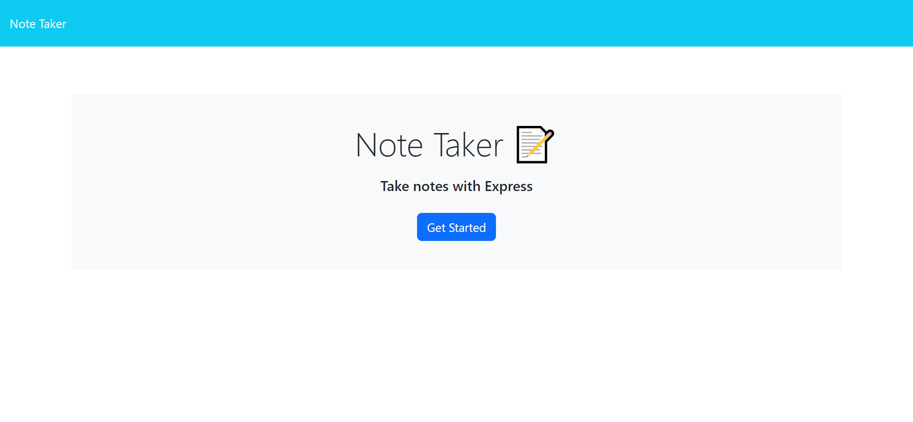
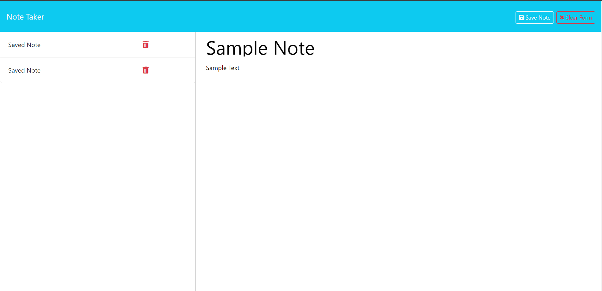

# Note Taker

## Description
This is a simple note taker application where users can type in notes to be saved for later. 

## Table of Contents
- [Installation](#installation)
- [Usage](#usage)
- [License](#license)
- [Contributing](#contributing)
- [Tests](#tests)
- [Questions](#questions)

## Installation
The application can be installed by downloading or cloning the repository to your local code space and then using the "npm run start" command to open a local server on the PORT: 3001. Then you will be able to start taking notes.

## Usage
This project it intended to be used by anybody who needs to keep track and organize their thoughts in a simple and concise way. This app features a landing page with a link to the notes page, a new note and save note function, as well as a delete note function that will be added in the future.

## Screenshots

## License
This project is licensed under the MIT - see the [LICENSE](https://opensource.org/licenses/MIT) for details.

## Contributing
N/A

## Tests
N/A

## Questions
Got questions? Reach out to me on [GitHub](https://github.com/Jarede712) or by [email](mailto:jaredeichhorst@gmail.com).

